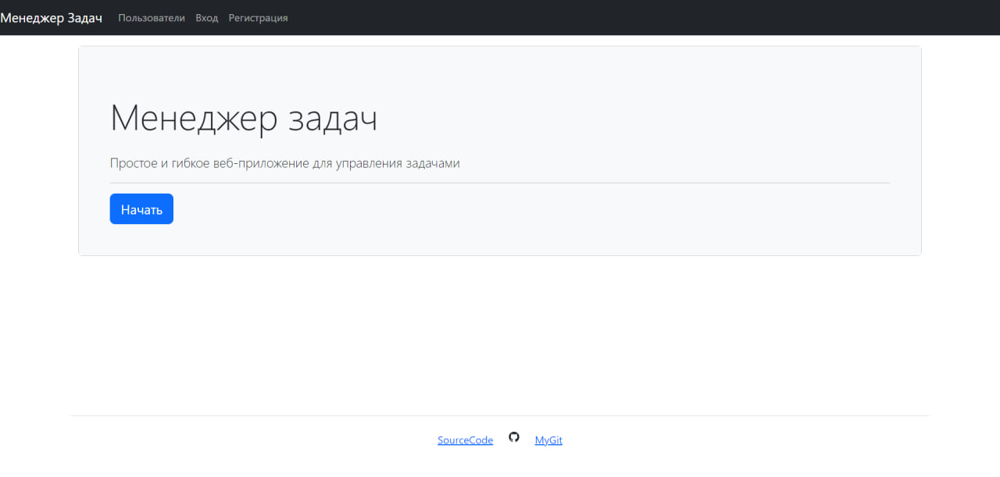

### Task Manager

## Hexlet tests/Codeclimate badges and linter status:
[](https://github.com/thiSSSnake/python-project-52/actions)
[](https://codeclimate.com/github/thiSSSnake/python-project-52/maintainability)
[](https://codeclimate.com/github/thiSSSnake/python-project-52/test_coverage)

# About Service
Task Manager is a flexible web application for creating and tracking tasks. 
The service requires user registration and authorization. The functionality allows you to create and view tasks yourself, assign an executor from existing users, add various statuses /labels for tasks.

[Live domen](https://python-project-52-l0by.onrender.com)


## Dependencies
- _python = "^3.10"_
- _django = "^5.0.4"_
- _python-dotenv = "^1.0.1"_
- _psycopg2-binary = "^2.9.9"_
- _dj-database-url = "^2.1.0"_
- _whitenoise = {extras = ["brotil"], version = "^6.6.0"}_
- _gunicorn = "^22.0.0"_
- _uvicorn = "^0.29.0"_
- _django-bootstrap5 = "^24.2"_
- _django-filter = "^24.2"_
- _rollbar = "^0.16.3"_
- _pytest = "^8.2.0"_

## Install & Start
```bash
git clone git@github.com:thiSSSnake/python-project-52.git
cd python-project-52/
# install poetry
make install
# start server locally
make start
```